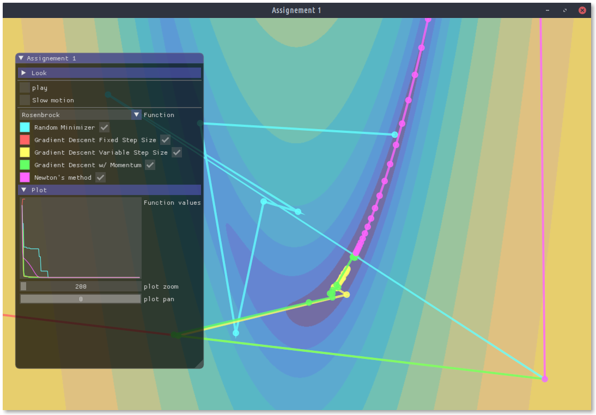

# Assignment 1 - Numerical Optimization

Please fill in your name and student id:

| First name: | Last name: | Student ID: |
| ----------- | ---------- | ----------- |
|             |            |             |

For a more readable version of this document, see [Readme.pdf](Readme.pdf) or [Readme.html](Readme.html).

**Deadline:** March 15th 2019, 1pm. Only commits ***pushed*** to github before this date and time will be considered for grading.

**Issues and questions:** Please use the [issue tracker](https://github.com/computational-robotics-lab/comp-fab-a1) of the main repository if you have any general issues or questions about this assignment. You can also use the issue tracker of your personal repository or [email me](mailto:moritzge@inf.ethz.ch).

> Note: The bug in github classroom was fixed. This repository should be automatically imported into your private one.

## Assignment

In this first assignment, you will implement and compare various strategies to solve the unconstrained minimization problem
$$
x = \text{argmin}_\tilde{x} f(\tilde{x}).
$$




### 1. Random minimization

A naive way to find a minimum of $f(x)$ is to randomly sample the objective function $f(x)$ over a prescribed search domain. 

**Task:** Implement an optimization routine, that samples a search domain $\Omega_s$ and saves the best candidate $x_B$ and its corresponding function value $f(x_B)$.

**Relevant code:** 

In the file `src/optLib/RandomMinimzier.h`, implement the method `minimize(...)` of class `RandomMinimizer`. 

The members `searchDomainMin/Max` define the minimum and maximum values of the search domain, $\Omega_s = [\text{searchDomainMin}, \text{searchDomainMax}, ]$, for each dimension. E.g. `searchDomainMin[i]` is the lower bound of the search domain for dimension $i$. The variables `xBest` and `fBest` should store the best candidate $x_B$ and function value $f(x_B)$ that has been found so far.

The method runs in a for loop. To compare it to other optimization techniques, `iterations` has been set to 1.

**Hints: ** [`std::uniform_real_distribution`](https://en.cppreference.com/w/cpp/numeric/random/uniform_real_distribution) can generate random numbers.

### 2. Gradient Descent

**Task:** Implement Gradient Descent with fixed step size, variable step size and with Momentum.

**Relevant code:**

The file `src/optLib/GradientDescentMinimizer.h` contains three classes:

- `GradientDescentFixedStep`: implement the method `step(...)`. It shall update `x` to take a step of size `stepSize` in the direction of the search direction `dx`. The search direction was previously computed in the method `computeSearchDirection(...)`, which calls `obj->addGradient(...)` to compute $\nabla f(x)$.
- `GradientDescentVariableStep`: implement the method `step(...)`. Instead of fixed step size, use the Line Search method to iteratively find the best step size. `maxLineSearchIterations` defines the maximum number of iterations to perform.
- `GradientDescentMomentum`: implement the method `computeSearchDirection(...)` to compute the search direction according to Gradient Descent with Momentum.

**Hint:** Note that before calling `obj->addGradientTo(grad, x)`, you need to make sure `grad` is set to zero (`grad.setZero()`). Or you simply use `obj->getGradient(x)`, which returns $\nabla f(x)$.

### 3. Newton's method

**Task:** Implement Newton's method with global Hessian regularization.

**Relevant code:**

In the file `src/optLib/NewtonFunctionMinimizer.h` , implement the method `computeSearchDirection(...)` to compute the search direction according to Newton's method. The `ObjectiveFunction` has a method `getHessian(...)` that computes the Hessian.

**Hint:** The Eigen library provides various solvers to solve a linear system $Ax=b$, where A is a sparse matrix. Take a look at the example in the documentation [here](https://eigen.tuxfamily.org/dox/group__TopicSparseSystems.html). Thus, to solve $Ax=b$, you could use e.g. this:

```c++
Eigen::SimplicialLDLT<SparseMatrix<double>, Eigen::Lower> solver;
solver.compute(A);
x = solver.solve(b);
```

### 4. Let's compare!

Now that you have implemented different optimization methods, let's compare and try them out on different functions. Give an answer to the following questions. Please write your answers below the questions, and don't forget to commit and push!

1. Let's look at the Gradient Descent with fixed step size and the quadratic function $f(x) = a^Txa + b^Tx + c$. 
   What is the maximum step size, such that Gradient Descent with fixed step size still converges and finds the minimum? Can you give an explanation for this particular value of the step size? What happens when we change $a$, $b$ or $c$?

   *your answer*

2. Let's look at Gradient Descent with variable step size, Gradient Descent with Momentum and the Rosenbrock function.
   Which method performs better? Why?

   *your answer*

3. Let's look at Newton's method and the quadratic function.
   What is the best (in terms of convergence) choice for the Hessian regularizer? How many iterations does it take to converge and why does it take exactly that many iterations?

   *your answer*

4. Let's look at Newton's method and Gradient Descent with fixed step size.
   Set the step size of Gradient Descent to $0.001$. What value for the (approximate) Hessian regularizer of Newton's do you choose, to make both methods converge almost identically? (They will not converge *exactly* the same.) Why is this the case?

   *your answer*

5. Finally, let's look at Newton's method and the sine function.
   The sine function has many local minima. Explain the effect the choice of the Hessian regularizer has on the local minimum Newton's method will converge to.

   *your answer*

---

## Setting things up

### Prerequisites

Make sure you install the following:

- Git (https://git-scm.com)
    + Windows: download installer from website
    + Linux: e.g. `sudo apt install git`
    + MacOS: e.g. `brew install git`
- CMake (https://cmake.org/)
    + Windows: download installer from website
    + Linux: e.g. `sudo apt install cmake`
    + MacOS: e.g. `brew install cmake`

### Building the code

On Windows, you can use Git Bash to perform the steps mentioned below.

1. Clone this repository and load submodules:
    ```
    git clone --recurse-submodules YOUR_GIT_URL
    ```
2. Make build folder and run cmake
    ```
    cd comp-fab-a0-XXX
    mkdir build && cd build
    cmake ..
    ```
3. Compile code and run executable
    - for MacOS and Linux:
        ```
        make
        ./src/app/app
        ```
    - for Windows: 
        * open `assignement0.sln` in Visual Studio
        * in the project explorer, right-click target "app" and set as startup app.
        * Hit F5!


### Some comments

- If you are new to git, there are many tutorials online, e.g. http://rogerdudler.github.io/git-guide/.

- You will not have to edit any CMake file, so no real understanding of CMake is required. You might however want to generate build files for your favorite editor/IDE: https://cmake.org/cmake/help/latest/manual/cmake-generators.7.html
